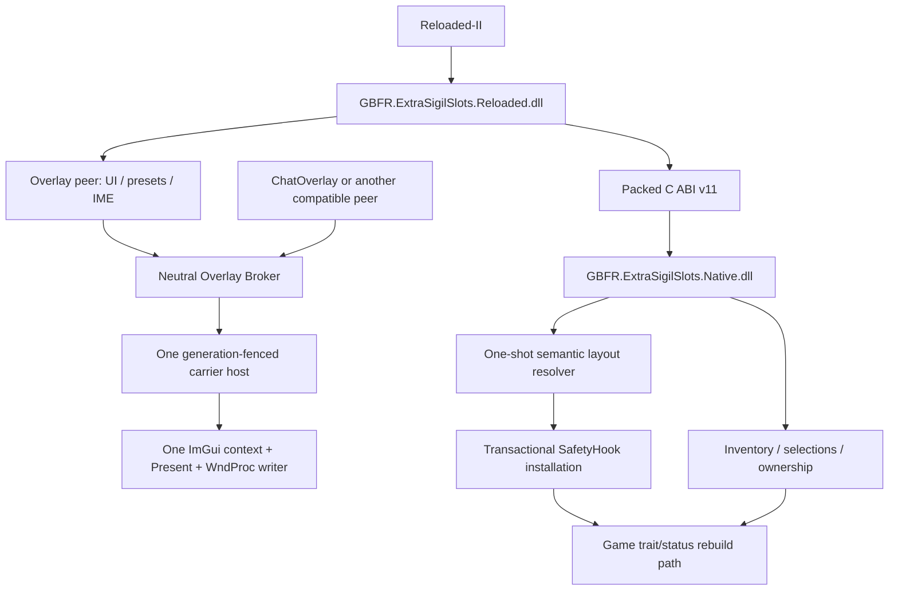
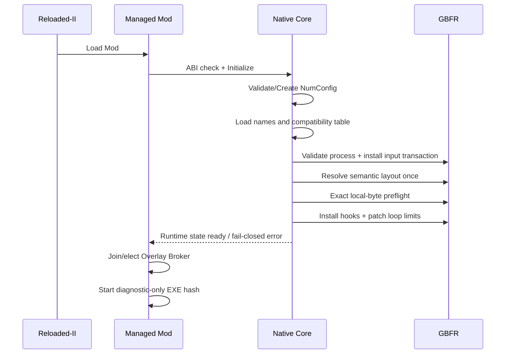
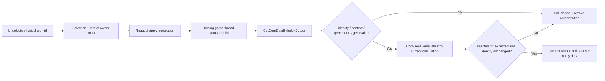

# GBFR Extra Sigil Slots 技术交接、问题复盘与代码精炼边界

> 面向对象：准备继续维护、审计或精炼本项目的模型／开发者
> 基线日期：2026-08-01
> 当前主线：`main`
> 初始审计基线：`5e54035` / `v0.7.8`
> 当前维护版本：`v0.7.9`
> 支持游戏版本：Granblue Fantasy: Relink Endless Ragnarok 2.0.2、2.0.3
> 仓库：`cajoxorize366-oss/GBFR-Extra-Sigil-Slots`

本文不是普通用户说明，而是一份“接手前必须读完”的工程交接。它说明这个 Mod 为什么会形成今天的结构、哪些问题已经踩过、GBFR Hook 和 ImGui 前端分别怎样工作、哪些看似冗余的代码其实是安全边界，以及后续模型可以在哪些范围内精炼代码。

行号基于 `5e54035`，以后提交可能使其漂移；定位时优先使用文中给出的符号名。

---

## 1. 当前仓库状态与工作区注意事项

- 本文最初以 `5e54035`／`v0.7.8` 建立代码地图；符号和行号引用仍以该基线为主。
- `v0.7.9` 收录了 CJK 字形范围扩展、菜单首次打开的重复热键／陈旧鼠标点击防护，以及命名预设的 Reloaded-II 持久目录迁移与损坏文件备份恢复。
- 接手前仍须先检查实际 `git status`；任何后来出现的用户修改都不得用 `git reset --hard`、`git checkout --` 或类似方式删除。
- `2026/7/18-backup` 分支保存重构前基线 `1351349`。
- `Dear_branch_preview` 等分支是实验记录，不是应继续合并到 `main` 的实现。

## 2. 一句话说明这个 Mod 在做什么

游戏原生界面只有 12 个可见本体因子槽；本 Mod 不改存档、不修改因子的 `GemData.WORN_BY`，而是在游戏重建角色状态、遍历因子数据时，通过 Hook 将玩家库存中真实存在且当前未装备的物理因子临时贡献给同一次本地状态计算，使每个角色获得 1–24 个可配置的“虚拟扩展槽”。

关键含义：

- 它不是凭空生成因子；扩展槽引用的是库存中的真实 `slot_id`。
- 同一个物理因子最多只有一个虚拟拥有者。
- 本体槽装备状态优先于虚拟拥有状态。
- 虚拟槽不会写进游戏存档，其他玩家不会看到这些额外槽位本身。
- 战斗数值由本地状态计算链消费，因此在线使用可能产生类似作弊的实际效果；这属于 Mod 的行为风险，而不是“仅显示 UI”。
- 游戏本身不支持任意战斗状态下安全热更新因子，所以 UI 会限制可编辑状态，并提示重新进入战斗／任务让变化稳定生效。

## 3. 总体架构

项目由三个逻辑部分组成：

1. `GBFR.ExtraSigilSlots.Native.dll`
   - C++ 原生核心。
   - 负责 PE／布局解析、游戏内存安全访问、SafetyHook、因子库存快照、物理槽归属、同线程状态重建和原生输入门。
2. `GBFR.ExtraSigilSlots.Reloaded.dll`
   - C# Reloaded-II Mod。
   - 负责生命周期、Reloaded-II 配置、ImGui UI、中文输入、预设、冲突提示和 Overlay Broker peer。
3. `GBFR.OverlayHub.Contracts.dll`
   - 进程内中立 Overlay Broker 合同和状态机。
   - 让 Extra Sigil、ChatOverlay 等兼容 Mod 以普通 peer 身份共享唯一的 ImGui／Present／WndProc writer。



原生与托管之间唯一正式边界是 `GBFR.ExtraSigilSlots.Native/native_api.h`。当前 ABI 版本为 11，使用 `__cdecl` 和 `#pragma pack(push, 1)`；结构字段顺序、尺寸、返回码和导出名不得静默变化。参见：

- `native_api.h:13-27`：ABI、容量和预设结果码。
- `native_api.h:31-132`：packed structs 与静态尺寸断言。
- `native_api.h:134-188`：全部 C 导出。
- `docs/native-architecture.md:18-21`：冻结 ABI 的正式约束。

## 4. 项目演进过程

下面只把 Git 可核验事实作为主线。某些 Win11、ReShade、Steam Input 现象来自实际调试与用户反馈，会在后文单独标注为“历史调试问题”。

| 阶段 | 关键提交 | 发生的事情 |
| --- | --- | --- |
| 初始原型 | `0259c046`，2026-07-17 | 0.3.0-test7；工程仍带 `ExtraSigilSlots20` 名称；原生逻辑集中在约 3488 行的 `main.cpp`；固定 RVA、固定字节契约，默认 8 个扩展槽。 |
| 一键包 | `8f5368f` | 增加 Reloaded-II ZIP 打包流程。 |
| 双语与输入 | `ca899b44`，2026-07-18 | 中英文 UI、中文输入、UTF-16／DBCS 处理、修复 GBK 乱码；区分完整物理扫描数量与过滤后的匹配数量。 |
| 预设与占用过滤 | `1b5044a` | 加入命名多角色预设、占用状态过滤、本体槽冲突、虚拟拥有权转移和确认弹窗。 |
| 槽位可配置 | `42ada1f` | 固定扩展槽改为 `VirtualSlotCount`，范围 1–24；配置文件更名为 `GBFR-ExtraSigilSlotsNumConfig.ini`。 |
| 手柄直通基线 | `1351349` | Overlay 打开时保留控制器输入；该提交成为 `2026/7/18-backup` 的重构前基线。 |
| 大拆分 | `5a1056d` | 删除 3851 行单体 `main.cpp`，原生拆成独立 translation units；托管输入、预设和 NativeCore 也拆分；新增架构文档与 smoke harness。 |
| DX11 加固 | `adba42f`、`3617368` (`v0.5.0`) | 加固 Overlay 输入和 Direct3D 11；采用 Present-only 路线。 |
| 闭窗休眠 | `0694c91` | Overlay 关闭时不再持续提交完整 ImGui frame。 |
| Reloaded 热键 | `7caf5ee` (`v0.7.0`) | F8 变为 Reloaded-II 可配置热键，不在 ImGui 内维护第二套热键编辑器。 |
| RTSS 链兼容 | `4324f35` | 解析已有 DX11 Present 跳转链，避免把另一个 Overlay 的跳板误当原函数。 |
| 哈希门禁放宽 | `a91374e` | EXE SHA-256 从强制门禁变成诊断；兼容决定回归局部字节预检。 |
| 输入隔离 | `7ccc434` (`v0.7.1`) 至 `a0cb39b` (`v0.7.4`) | 修复键鼠穿透、闭窗仍捕获、鼠标冻结与打开瞬间陈旧点击。 |
| 启动与输入 Hook 加固 | `e000e6b` (`v0.7.5`) | 分阶段启动日志、输入事务、ASI／Launcher 诊断进一步稳定。 |
| 中立 P2P Broker | `82256d7` (`v0.7.6`) | Extra Sigil 和 ChatOverlay 变成普通 peer；一个中立 Broker 维护单一 writer。 |
| Broker 恢复 | `92f339d` (`v0.7.7`) | generation-fenced host lease、host 消失后的 surviving peer 接管与重新绑定。 |
| 2.0.3 与配置保护 | `5e54035` (`v0.7.8`) | 新增一次性语义布局解析器；支持 2.0.2／2.0.3；NumConfig 不再随包，合法文件不改，非法文件先备份再重建。 |
| 首次输入与预设持久化 | `v0.7.9` | 热键需抬起后才能再次触发；鼠标完整事件序列参与首次交互门控；首次库存只刷新一次；命名预设迁入 Reloaded-II 持久配置目录，损坏 JSON 按内容哈希备份后恢复。 |

### 4.1 已放弃或只保留作研究的路线

- `Dear_branch_preview` 曾尝试迁移到官方 C++ Dear ImGui 后端。
- Hexa.NET.ImGui + Backends 也曾用于快速迁移实验。
- 这些实验暴露了 ReShade、DLSS、其他宽屏／图形补丁和引用计数链的黑屏或共存问题，最终没有成为主线。
- 不要因为分支中存在较新的 UI 库，就直接把实验代码复制回 `main`。当前主线的 Broker、共享 cimgui context、Present-only backend 和输入策略是一组共同成立的系统，不是可以单独替换的部件。

## 5. 当前 Mod 的完整工作流程

### 5.1 Reloaded-II 加载阶段

1. Reloaded-II 根据 `ModConfig.json` 加载托管 DLL。
2. 托管层定位并加载 `GBFR.ExtraSigilSlots.Native.dll`。
3. `NativeCore.Initialize` 校验 ABI 版本 11；不匹配直接抛出错误，不允许带着错位结构继续运行。
4. 托管层注册 Reloaded-II 热键配置，默认 F8；热键变化通过 C ABI 同步给原生和前端 gate。
5. 托管层作为普通 peer 注册到进程内 Overlay Broker；如果没有可用 carrier，则参与选举。
6. 完成原生初始化后，托管层才启动后台 EXE SHA-256 诊断。该诊断不参与 Hook 安装决策。

### 5.2 原生初始化阶段

`GBFR.ExtraSigilSlots.Native/src/runtime.cpp:7-122` 的 `Initialize` 按阶段同步执行：

1. 解析 native DLL 所在目录，确定 NumConfig、名称表、兼容表路径。
2. `LoadSettingsAndSelections(false)`：先加载配置和已保存选择，但在确认游戏布局前不激活虚拟 ownership。
3. 加载当前语言的因子名称表。
4. 强制校验当前进程名必须是 `granblue_fantasy_relink.exe`。
5. 独立安装键鼠输入 IAT／DirectInput 门；部分安装失败会完整回滚，但不会伪装成成功。
6. 加载角色专属因子兼容表；条目数或内容不完整时停止 gameplay hook。
7. 运行一次 `ResolveGameLayout()`。
8. 布局确认后再次 `LoadSettingsAndSelections(true)`，此时才重建内存 ownership。
9. `InstallHooks()` 同步安装游戏逻辑 Hook 和两处循环上限 patch。
10. 设置初始化完成状态并输出每阶段 `begin / complete / failed / elapsed_ms` 日志。

这个顺序不能异步化。若把布局解析或 Hook 安装扔到后台线程，游戏可能先执行到未 Hook 的代码，再在中途被改写，形成更难复现的竞态。



### 5.3 打开和关闭菜单

1. 热键事件唤醒 `FrontendOverlayGate`。
2. peer 的 `WantsRender` 变为 true；Broker host 才为该客户端提交 ImGui UI。
3. 菜单打开时，Broker 聚合所有 peer 的键盘、鼠标和文本捕获需求。
4. WndProc 顺序固定为：
   - peer 先观察消息；
   - ImGui Win32 handler 处理；
   - 按设备类型判断是否吞掉；
   - 未捕获消息转给原始 WndProc。
5. 键盘、鼠标、IME 文本可被捕获；Raw HID、XInput、DirectInput gamepad 和未知设备放行。
6. 菜单关闭时立即释放 `SetCapture`／`ClipCursor` 状态，清理 ImGui 鼠标键和陈旧点击，不再让无边框窗口被 Mod 持续占用。

“关闭时不渲染”并不等于卸载 Present Hook。Present carrier 仍需维持 Broker 和必要 tick；当没有 peer 请求渲染时，后端跳过完整 ImGui frame，减少后台开销。

### 5.4 扫描库存与显示因子

1. 原生从已解析的 `SystemData` 全局和 `main_gem_array_offset` 找到主因子数组。
2. 最多扫描 `kMainGemCapacity = 5100` 个物理位置。
3. 每个条目通过安全读取验证，建立 `slot_id -> address` 索引和不可变快照。
4. 完整有效物理扫描数与 UI 当前过滤匹配数是两个不同指标，不能混为一谈。
5. UI 可按以下条件显示：
   - 所有因子；
   - 已使用；
   - 本体已使用；
   - 扩展已使用；
   - 未使用（默认）。
6. `InventoryItem` 同时携带本体装备状态、角色限制、虚拟拥有角色和虚拟槽位，因此 UI 不需要自己猜占用关系。

### 5.5 选择、转移和预设

1. 用户点击一个因子时，原生按物理 `slot_id` 验证它是否仍存在、是否本体装备、是否禁用、是否受角色限制。
2. 若本体已装备，不允许直接放入虚拟扩展槽，提示用户先在对应角色本体栏卸下。
3. 若已经被另一个角色虚拟占用，UI 显示确认对话；确认后清除旧角色与预设引用，再转移 ownership。
4. `SetSelection` 在同一把 selection 锁下更新角色数组和反向 owner map，然后持久化受影响角色。
5. 预设套用先在临时副本中验证所有角色和槽位，再一次性替换内存状态；冲突槽位独立返回结果，其余合法槽继续套用。
6. 预设文件保存使用临时文件 + replace；失败时恢复内存副本。

### 5.6 将扩展因子贡献到角色状态

核心不是修改 UI 数量，而是拦截游戏读取因子数据的路径：

1. `InstallHooks` 安装 `GetGemDataByIndex` inline hook、trait fetch mid hook 和 status owner loop mid hook。
2. 原游戏循环上限是内部 13 项；用户可见本体槽是 12 个，虚拟槽从内部索引 13 开始。
3. 两处循环 immediate 从原始 13 改为 `13 + VirtualSlotCount`。
4. 游戏遍历虚拟索引时，`GetGemDataByIndexDetour` 根据当前角色选择找到真实物理 `slot_id`。
5. 读取的 `GemData` 必须满足：
   - `slot_id` 仍一致；
   - `worn_by == kUnwornCharacterHash`；
   - 禁用 flag 未设置；
   - 角色专属限制匹配；
   - 当前 status identity、context 和 generation 与本次状态重建一致。
6. 校验通过后把真实 `GemData` 复制给游戏本次计算，而不是修改原对象的装备归属。
7. 预期注入数量、实际注入数量、TLS 线程、角色身份和最终 status identity 必须全部一致，才提交 authorized status。
8. 失败会产生明确 apply result 并撤销授权，而不是“尽量凑合”地留下半套属性。



## 6. 2.0.3 之后的 GBFR Hook 地址解析方式

### 6.1 为什么不再用整文件哈希或固定 RVA

早期版本把特定 EXE SHA-256 和固定 RVA 当成门禁。这会出现两类误判：

- EXE 整体哈希不同，但 Hook 入口和局部字节仍完全兼容，功能却被拒绝。
- 2.0.3 中函数、全局和字段地址并不是统一加一个 delta；简单平移旧 RVA 会得到错误位置。

当前 `layout_resolver.cpp` 在启动时只运行一次：

1. 验证 PE image 和可执行范围。
2. 对 apply loop、category loop、notifier、owner tick、UI 等语义锚点做唯一模式匹配。
3. 从 call graph、RIP-relative 引用和指令操作数推导：
   - Hook 函数入口；
   - 两处 loop immediate；
   - SystemData／StatusManager／UI 全局；
   - 对象字段和哈希 map 偏移。
4. 要求两个 trait loop 共享同一个 getter 关系，原始循环上限仍是 13。
5. 用精确局部字节契约重新验证每一个将要 Hook 或 patch 的位置。
6. 只有全部唯一且一致时才发布不可变的 `ResolvedGameLayout`。

关键位置：

- `layout_resolver.cpp:317`：`FindUniquePattern`。
- `layout_resolver.cpp:438`：map offsets 解析。
- `layout_resolver.cpp:511-605`：`ValidateResolvedGameLayout`。
- `layout_resolver.cpp:628-810`：`ResolveGameLayout`。
- `layout_resolver.cpp:812-819`：安装前 `RevalidateGameLayout`。

### 6.2 后续游戏更新能自动兼容到什么程度

能自动兼容的前提：

- 语义锚点仍唯一；
- 调用／引用关系仍成立；
- 关键指令和局部字节契约未变；
- 推导出的对象偏移仍在合理范围。

不能承诺自动兼容：

- 函数被大幅重写或内联；
- 关键 loop／getter 结构变化；
- 同一模式出现多个无法消歧的候选；
- 对象布局或容器结构发生语义改变。

遇到上述情况时，正确行为是失败关闭 gameplay hooks，并在 Overlay 显示兼容错误；不能退回“找到第一个像的地址就 Hook”。

### 6.3 EXE SHA-256 现在的作用

- 只在 Hook 同步初始化完成后，由托管层后台计算。
- 日志标记为 `diagnostic_only=true`。
- 不放行、不拒绝、不回滚 Hook。
- 便于收集用户版本信息，但不是安全证明。

## 7. ImGui 与 Overlay Broker 的当前设计

### 7.1 为什么必须只有一个图形 writer

多个 Mod 分别 Hook 同一 Present、分别维护 WndProc、分别创建 cimgui context 时，加载顺序会改变原函数链和 context 所属 ALC，容易出现：

- 一个 Mod 能呼出菜单，另一个 peer 使用空 ImGui context；
- RTSS／ReShade／Steam Overlay 插入顺序变化后 trampoline 失效；
- 两个 Mod 同时控制光标和键鼠，关闭一个后仍锁住游戏；
- host 卸载或故障后所有 guest 都永久失效。

因此当前模型是“业务层 P2P + 中立单写者 Broker”：

- Extra Sigil 和 ChatOverlay 都是普通 peer。
- 谁先加载，谁可以成为 bootstrap carrier，但 carrier 没有业务特权。
- 进程内始终只有一个 `OverlayBrokerHost` 拥有 Present、WndProc、ImGui frame 和原生输入 transition。
- host 失效后，存活 peer 可获取下一代 generation lease，重建 writer 并重新绑定所有 peer。
- 旧 generation 的 host 即使迟到，也不能再发布 graphics 或输入状态。

这不是“永远指定 ChatOverlay 当 host”，也不是“每个 peer 各 Hook 一遍”。

### 7.2 Broker 核心骨架

关键不变量见 `GBFR.ExtraSigilSlots.Reloaded/OverlayBroker/README.md:15-25`：

- Reloaded-II 只发布 `IGbfrOverlayHub`。
- 唯一 host lease 有 generation fencing。
- peer 异常只禁用该 peer。
- writer 失败时释放 lease，下一 peer 可以恢复。
- controller／HID 永不进入捕获 mask。
- Contracts 与 runtime 共享源必须在 Extra Sigil 和 ChatOverlay 两仓库中逐字节一致。

核心文件：

- `GBFR.OverlayHub.Contracts/OverlayBroker.cs`
  - 中立 registry、peer weak reference、输入聚合、host generation 状态机。
- `GBFR.ExtraSigilSlots.Reloaded/OverlayBroker/OverlayBrokerElection.cs`
  - 使用 `Local\GBFR.OverlayBroker.Election.{PID}` mutex 在不同 ALC 间原子选举。
- `OverlayBrokerHost.cs`
  - 唯一 Present／WndProc writer；发布 graphics binding；控制鼠标捕获。
- `SharedImguiGraphicsBinding.cs`
  - 发布 host 的精确 cimgui module handle 和 ImGui context pointer。
- `HostedImguiBinding.cs`
  - peer 通过 `DllImportResolver` 绑定到同一个 cimgui module，并校验当前 context 指针。
- `OverlayWindowInputClassifier.cs`
  - 按消息和 RawInput 设备类型决定捕获。

### 7.3 共享 cimgui context 的必要性

.NET AssemblyLoadContext 之间即使加载“同名” DearImguiSharp，也可能各自解析到不同的 native cimgui 和不同全局 context。只共享 C# 对象并不够。

当前 binding 同时传递：

- `NativeLibraryHandle`；
- `ContextPointer`；
- graphics binding version。

peer 渲染前必须通过 `HostedImguiBinding.EnsureCurrentContext` 确保使用 host 的 exact context。绑定失败时 fail closed，不允许拿空 context 继续调用 ImGui。

### 7.4 Present-only 后端

`SafeImguiHookDx11.cs` 采用 Present-only 思路：

- 不依赖本项目自己再 Hook `ResizeBuffers`；
- 每帧按需要创建 RenderTargetView；
- 渲染后恢复 D3D11 Output Merger 状态；
- 原始 Present 调用经过 native boundary 和跳转链解析；
- 目标是与 RTSS、MSI Afterburner、ReShade 等已有 Present hook 共存。

它不能保证兼容所有任意第三方 DLL，但应在发现已有不兼容 writer 或无效链时失败关闭，而不是继续叠加未知 Hook。

## 8. 输入、IME 与手柄策略

### 8.1 键鼠捕获

菜单打开时需要阻止游戏同时响应：

- `WM_KEYDOWN/UP`、`WM_SYSKEY*`；
- `WM_CHAR`、`WM_UNICHAR`、IME composition；
- 鼠标移动、左右／中／X 按键、滚轮和非客户区鼠标消息；
- RawInput 中明确识别为键盘或鼠标的设备。

WndProc 的处理顺序、always-captured 消息和异常路径不可随意交换，否则会重新出现“搜索栏输入时游戏角色也操作”或“鼠标点击仍穿透”。

### 8.2 手柄直通

Mod 的目标是只劫持键盘和鼠标：

- DirectInput `GUID_SysKeyboard` 和 `GUID_SysMouse` 可被门控。
- XInput、DirectInput gamepad、Raw HID 和未知未来设备类型放行。
- 不应靠“拦所有 DirectInput 再猜是不是手柄”。
- Steam Input 可能把 PS 手柄转换成不同输入来源，因此 RawInput／DirectInput 分类必须保守；无法确认是键鼠时默认放行。

### 8.3 中文输入

早期直接处理按键字符导致中文输入出现 `ÔÚ` 等 GBK／ANSI 乱码，而复制粘贴正常。当前路径使用 Win32 IME：

- `WM_IME_STARTCOMPOSITION`；
- `WM_IME_COMPOSITION`；
- `ImmGetCompositionStringW`；
- UTF-16 注入 ImGui；
- composition 结束时清状态。

字体侧还需包含中文、全角标点、CJK 标点和用户自定义预设名所需字形。当前工作区的 `CjkConfiguredDx11Hook.cs` 有用户未提交扩展，重构时必须保留。

## 9. 配置、选择与预设的数据完整性

### 9.1 NumConfig 生命周期

从 `v0.7.8` 开始：

- 所有正式发布 ZIP 都不附带 `GBFR-ExtraSigilSlotsNumConfig.ini`。
- 文件缺失：原生创建完整默认配置。
- 文件合法：启动逐字节不改。
- 文件非法：先把实际读取到的原始字节备份为 `.invalid-时间戳.bak`，再通过临时文件 + `MoveFileExW(...WRITE_THROUGH)` 原子创建默认配置。
- 备份失败或无法安全读原字节：保留原文件，不进行破坏性覆盖。

完整验证包括：

- `ConfigVersion == 2`；
- `ToggleKey` 在 1–255；
- `ShowEquipped` 为 0/1；
- `AutoApply == 1`；
- `Language` 为 `en` 或 `zh-CN`；
- `VirtualSlotCount` 为 1–24；
- `Character_XXXXXXXX` 唯一、非零；
- `Slots` 每项为 8 位十六进制，最多 24 项；
- 非零物理 `slot_id` 不能跨角色重复。

实现集中在 `config_store.cpp:123-465`。

### 9.2 物理 ownership 与虚拟 ownership

必须区分三个概念：

1. `GemData.worn_by`
   - 游戏本体装备归属。
   - Mod 永不修改。
2. `g_virtual_owner_by_slot_id`
   - Mod 内存中的 `slot_id -> {character_hash, virtual_slot}`。
   - 保证一个物理因子最多一个虚拟 owner。
3. `g_authorized_statuses`
   - 某次角色 status 重建成功后的地址／身份授权。
   - 不是因子 ownership，不能混用。

### 9.3 预设事务

托管 `SigilPresetStore` 的写操作都先 clone 文档：

- mutation 成功后 normalize、写临时文件、replace、重建引用索引；
- mutation 或文件写失败时恢复内存副本；
- 清除因子引用后执行 ownership 转移，若转移失败则把预设引用写回；
- 单个预设最多 32 个角色，每个角色固定容量 24；同一预设中的非零物理槽去重。

原生 `ApplyPresetSelections` 也先构造临时 next state，再整体替换内存 selections。注意：之后逐角色保存到 INI 不是一个跨多个 section 的文件级事务；这是可以进一步改进但风险中等的边界。

## 10. 已做的防御性措施

这些措施不能只因为“代码很多”就删掉。

### 10.1 兼容性防御

- 强制进程名校验。
- PE image／section／RVA 范围校验。
- 语义锚点必须唯一。
- 解析出的函数、global、field offset 必须互相满足指令关系。
- 每个 Hook／patch 点安装前做精确局部字节复核。
- 歧义或缺失时整套 gameplay transaction 失败关闭。
- SHA-256 只诊断，不冒充兼容证明。

### 10.2 内存访问防御

- 所有游戏内存读取经 SEH-safe helper。
- 指针要经过 image／可读写／可执行范围判断。
- 数组跨度和地址运算做溢出检查。
- `GemData` 复制前重新验证 `slot_id`、装备状态、flag 和角色限制。
- 调用 status rebuild／notifier 用 SEH 隔离，并在调用后重读 identity。

### 10.3 Hook 事务防御

- Hook 安装顺序固定。
- 任一 SafetyHook 或 byte patch 失败即回滚此前全部步骤。
- 回滚时先撤销 ready 状态并 disable hooks。
- 等待 active getter／mid／input callback 计数归零后再释放对象。
- 只在当前字节仍等于本 Mod 写入值时恢复原 loop immediate，避免覆盖其他后来修改。
- `FlushInstructionCache` 并回读确认 patch。

### 10.4 并发与线程身份防御

- status rebuild 必须发生在游戏 owner thread。
- TLS 保存 apply generation、natural contribution frame 和 context binding。
- 角色 hash、context、status address、expected/injected count 必须在调用前后相符。
- in-flight CAS 防止同一 apply 重入。
- Overlay Broker 使用 generation lease 防陈旧 host 写入。
- 注册 peer 异常被隔离，不允许穿透 Present／WndProc。

### 10.5 数据防御

- 不写 SaveData，不改 `WORN_BY`。
- 物理 `slot_id` 是唯一身份，不按显示名或 trait hash 猜同一物品。
- 本体装备优先；已装备、禁用、丢失、角色不匹配的虚拟选择在快照更新时清除。
- 合法 NumConfig 启动不重写；非法先备份。
- 预设 mutation 和 ownership 转移都有回滚路径。
- inventory 全扫描失败时不发布半个新快照。

### 10.6 图形与输入防御

- 进程只允许一个 Broker graphics writer。
- host publish 的 cimgui module 和 context 必须精确匹配。
- WndProc 输入按 Keyboard／Mouse／Text 聚合，HID/controller 不进入 mask。
- 鼠标 capture／clip 状态保存、释放、恢复均有明确生命周期。
- Overlay 关闭或 host 失败时强制释放输入。
- Present 原函数链有跳转深度、循环和不可执行目标拒绝逻辑。

### 10.7 生命周期防御

- `DllMain` 只保存 module／设置 shutdown flag，不在 loader lock 内做复杂工作。
- `Mod.CanUnload == false`；当前不承诺动态卸载。
- shutdown 先停止新工作，等待 callback 静默，再恢复 patch 和释放 hook。
- resolved layout 发布后保持不可变；shutdown 只撤销 ready，不清掉可能仍被读者看到的结构。

## 11. 遇到过的主要问题、原因与最终处理

| 问题 | 实质原因 | 最终处理／教训 |
| --- | --- | --- |
| 因子扫描数量明显偏少 | 把完整库存扫描数量与“隐藏已使用因子后的过滤结果”混在一起理解 | 原生扫描物理库存，UI 独立显示完整有效扫描数和过滤匹配数。过滤不能改变扫描事实。 |
| 中文手打变成 `ÔÚ`，粘贴正常 | 按键／字符路径走了 ANSI／DBCS，而粘贴文本是 Unicode | 处理 IME composition 和 UTF-16；不要用按键码模拟中文字符。 |
| 中文句号、角色分隔符显示 `?` | 字体或 glyph ranges 缺标点／全角区段 | 加入 CJK 标点、假名、兼容表意文字和全角字形；该覆盖范围已在 `v0.7.9` 纳入主线。 |
| 预设冲突时点击无反应 | 原生拒绝了已装备／已占用因子，但 UI 没把结果升级为交互流程 | 明确本体占用与虚拟占用两类对话；虚拟转移要同步改当前槽和预设引用。 |
| 固定 8 槽难扩展 | 早期常量散落在 native/UI/配置 | C ABI 固定容量 24，运行时 active count 1–24；循环 patch 使用 active count。 |
| ImGui 关闭后仍有卡顿 | 即使 UI 不可见也提交完整 frame／做前端工作 | 加 `FrontendOverlayGate` 和 `HasRenderableClients`；闭窗跳过完整 frame，但保留最小 carrier tick。 |
| Win11 上 ResizeBuffers／Present 崩溃 | 托管／非托管 original callback 边界、Hook 链和 ResizeBuffers 生命周期在不同 Overlay 顺序下不稳定 | 主线采用 Present-only backend、native original-Present boundary 和 hook-chain resolver。不要恢复旧 ResizeBuffers 方案。 |
| Hexa.NET／C++ Dear ImGui 预览在 ReShade、DLSS 下黑屏 | 新 backend 重新拥有 swapchain／context，未复现 Luma／ReShade 的完整共存链 | 实验分支暂存或废弃；主线不继续叠补丁。迁移图形栈必须单独立项并用真实组合矩阵验证。 |
| RTSS／MSI Afterburner 共存崩溃 | 在已经被跳转改写的 Present 上再次 inline hook，原函数 trampoline 指向错误层 | 解析已有跳转链，检测循环／深度／无效目标；只在安全 target 上安装。 |
| 不同 2.0.2 EXE 被拒绝 | 整文件哈希是过强门禁，局部代码实际仍兼容 | SHA 改诊断；真正门禁是完整局部字节和结构预检。 |
| 2.0.3 更新后鼠标卡住、预设为空 | 游戏地址和字段偏移发生非统一变化，固定 RVA 读取错误 | 新增一次性 semantic resolver；推导 Hook/global/offset 并精确复核。 |
| 搜索输入时游戏也响应键鼠 | 一次“放行手柄”的修改把键盘／鼠标也放行 | 输入策略改为明确设备 mask，只放行 controller/HID。 |
| 鼠标移动不乱但点击仍穿透 | 只拦移动／键盘，没有完整覆盖 mouse button 和非客户区消息 | 完整 WndProc mouse 分类、RawInput 分类和 native mouse capture transition。 |
| 无边框窗口无法拖动 | Overlay 隐藏后仍持有 capture／clip 或仍拦截非客户区鼠标 | 关闭时强制释放并恢复原窗口状态。 |
| 打开菜单时鼠标短暂冻结或随机换因子 | 打开瞬间沿用了上一个 frame 的按钮状态；两帧之间完整发生的按下／抬起会被“当前未按住”判断遗漏 | 热键增加 key-up latch；鼠标门控同时追踪完整按钮事件序列，最后一次事件后经过干净帧才允许交互。 |
| 两个 ImGui Mod 一个能开、另一个空 context | host／guest 在各自 ALC 加载了不同 cimgui context；固定 host 退出后 guest 无法恢复 | P2P peer + 中立 Broker + exact graphics binding + generation recovery。 |
| Steam 启动／ASI 模式首次加载卡死或闪退 | 注入顺序与 DirectInput／ReShade／Reloaded bootstrapper 顺序变化；粗暴异步安装又会制造新竞态 | 保持 Hook 同步，输入事务独立回滚；记录启动 phase；只识别官方 bootstrapper 模块和 `InitializeASI`。native DLL 本身不是 `.asi`。 |
| 更新包覆盖或重置槽位配置 | NumConfig 曾随包复制，安装器覆盖用户文件 | `v0.7.8` 起任何包都排除 NumConfig；运行时缺失创建、合法不动、非法备份后重建。 |
| 更新后命名预设丢失 | 预设 JSON 曾保存在可能被安装器替换的 Mod 目录 | `v0.7.9` 起改存 Reloaded-II 持久配置目录；启动时验证并迁移旧 JSON，损坏目标先按内容哈希备份，再从有效副本恢复。 |

## 12. 代码地图与职责

### 12.1 原生核心

| 文件 | 主要职责 | 风险 |
| --- | --- | --- |
| `native_api.h` | 冻结的 C ABI、packed structs、导出 | 极高，除非显式 bump ABI |
| `native_internal.h` | 跨模块私有状态和 `ResolvedGameLayout` | 高，改动会扩散所有原生模块 |
| `src/runtime.cpp` | 初始化顺序、phase、tick/apply result | 高 |
| `src/runtime_state.cpp` | 全局原子、状态、消息 | 高 |
| `src/layout_resolver.cpp`（820 行） | PE、唯一语义锚点、call/RIP/offset 推导、精确预检 | 极高 |
| `src/trait_hooks.cpp`（713 行） | detour、TLS、trait contribution、安装/回滚/关闭 | 极高 |
| `src/safe_game_access.cpp`（707 行） | SEH 安全读、身份/map/status rebuild/notifier | 极高 |
| `src/input_capture.cpp`（818 行） | USER32/DInput8 IAT、实例方法门、设备分类 | 极高 |
| `src/config_store.cpp`（681 行） | NumConfig 校验／备份／原子创建、选择持久化 | 中高 |
| `src/inventory_store.cpp` | 5100 槽扫描、索引、快照、失效选择清理 | 高 |
| `src/selection_store.cpp` | 选择、反向 ownership、预设 apply 事务 | 高 |
| `src/name_tables.cpp` | 中英文名称表、角色专属兼容表 | 中 |
| `src/exports.cpp` | C ABI 防御性 wrapper | 高，保持薄层 |
| `src/dllmain.cpp` | loader-lock-safe 入口 | 极高但代码很小 |

### 12.2 托管前端

| 文件 | 主要职责 | 风险 |
| --- | --- | --- |
| `Mod.cs`（570 行） | Reloaded 生命周期、初始化、日志、主协调 | 中高 |
| `Mod.Input.cs` | Win32/IME 文本输入 | 高 |
| `Mod.OverlayHub.cs` | peer 注册、graphics rebind、host recovery | 极高 |
| `Mod.HotkeyConfiguration.cs` | Reloaded-II 热键联动 | 中 |
| `NativeCore.cs`（476 行） | ABI facade、运行时状态转换 | 高 |
| `NativeCore.Interop.cs` | P/Invoke declarations | 极高，必须与 native ABI 同步 |
| `SigilOverlayUi.cs`（589 行） | 主窗口、状态、菜单开关、鼠标生命周期 | 中高 |
| `SigilOverlayUi.InventoryPicker.cs` | 搜索、过滤、选择和冲突 UI | 中 |
| `SigilOverlayUi.Presets.cs` | 预设 UI 和结果提示 | 中 |
| `SigilPresetStore.cs` | JSON 预设、引用索引、事务回滚 | 中高 |
| `FrontendOverlayGate.cs` | 事件驱动 wake／closed-frame sleep | 高，代码虽小但语义关键 |
| `MouseButtonStateTracker.cs` | 窗口事件鼠标按钮状态 | 高 |
| `MouseInteractionGate.cs` | 打开瞬间 stale click 防护 | 高 |
| `SafeImguiHookDx11.cs`（498 行） | Present-only DX11 backend／状态恢复 | 极高 |
| `HostedImguiBinding.cs` | 跨 ALC exact cimgui/context 绑定 | 极高 |
| `CjkConfiguredDx11Hook.cs` | CJK font/glyph 配置 | 中；`v0.7.9` 扩展了字体候选和标点／假名／兼容字形范围 |
| `UiLocalization.cs` | 中英文 UI 文本 | 低 |

### 12.3 Overlay Broker

| 文件 | 主要职责 | 风险 |
| --- | --- | --- |
| `GBFR.OverlayHub.Contracts/OverlayHubContracts.cs` | peer/hub/graphics contracts | 极高，跨仓库同步 |
| `GBFR.OverlayHub.Contracts/OverlayBroker.cs`（631 行） | neutral registry、host generation、输入聚合、异常隔离 | 极高 |
| `OverlayBrokerElection.cs` | 跨 ALC 选举 | 极高 |
| `OverlayBrokerHost.cs`（432 行） | 唯一 writer、WndProc、鼠标 capture | 极高 |
| `SharedImguiGraphicsBinding.cs` | host binding 发布 | 极高 |
| `HostedImguiBinding.cs` | peer binding 消费 | 极高 |
| `VerifyOverlayBrokerSync.ps1` | 与 ChatOverlay 仓库字节同步校验 | 发布前必须运行 |

第三方文件 `third_party/Zydis.h`、`safetyhook.cpp` 很大，但不属于业务精炼范围。不要用“最大文件优先”策略去重写第三方代码。

## 13. 哪些代码可以精炼，哪些不能

### 13.1 低风险：可以先做

- 持续检查 ABI 文档漂移；`tests/README.md` 已在 `v0.7.9` 与 ABI 11 同步。
- 为 update-only 小包增加正式脚本；目前 `build-release.ps1` 只自动生成完整包，小包是额外流程。
- 统一重复日志格式、phase message 和 error formatting，不改变调用顺序。
- 把测试 harness 中重复的临时目录、native load、delegate lookup 抽成测试工具库。
- 继续把纯 UI 绘制段拆成 partial 文件，但不移动输入 gate、Broker 和 NativeCore 事务边界。
- 给配置校验返回结构化错误原因，替代大量无上下文 `return false`；必须保持同样的合法／非法集合。
- 整理注释、命名和只读辅助函数。

### 13.2 中风险：有测试后可做

- 将 `RollbackGameplayHookInstallation` 与 `ShutdownHooks` 中重复的 disable／quiesce／conditional restore 抽成共用 primitive。
  - 必须保留两者差异：shutdown 还处理输入、LocalContext1 状态和全局生命周期。
- 将 `layout_resolver.cpp` 的 exact byte contracts 做成只读 descriptor table。
  - 不得弱化唯一匹配、关系验证或每点回读。
- 把 `config_store.cpp` 拆成 parser、file lifecycle、settings/selection persistence 三层。
  - 合法文件逐字节不写、非法先备份是验收条件。
- 把 `input_capture.cpp` 的 IAT patch／VirtualProtect 操作提成共用小工具。
  - SEH、原地址校验、active callback 计数和事务回滚必须保留。
- 把 Broker 的重复异常日志提取为统一 peer guard。
  - 不能改变 lock 范围、generation 比较和 fault 隔离时序。
- 让多角色 selection 的文件持久化成为真正单文件事务。
  - 需要迁移与崩溃恢复设计，不能直接换写法。

### 13.3 高风险：禁止“为了少几行”轻动

- `native_api.h` 的导出、packing、字段顺序和尺寸。
- `ResolvedGameLayout` 的一次性发布与不可变语义。
- semantic resolver 的唯一锚点、call graph、RIP global 和 exact-byte preflight。
- `InstallHooks` 的同步顺序及失败回滚。
- `GetGemDataByIndexDetour` 的 TLS、generation、identity、context、expected/injected 计数顺序。
- status rebuild 必须在 owner game thread 的约束。
- safe read／SEH／地址范围／可执行性检查。
- input IAT／DirectInput 分类、RawInput 手柄放行。
- Broker 单 writer、generation lease、mutex election、跨 ALC cimgui/context binding。
- WndProc 的 peer→ImGui→device capture→original chain 顺序。
- Overlay 关闭／host 失败时强制释放鼠标和 native input。
- `DllMain` 的极简 loader-lock 行为和 quiescent shutdown。

## 14. LocalContext1 隔离区

`LocalContext1` callbacks、hook handles、map、TLS 和 offset 是早期实现遗留的隔离子系统。架构文档明确说明：当前 `InstallHooks` 从未安装它的两个 Hook，因此 callback 不可达，map 不能作为有效 ownership 证据。

接手模型只能二选一：

1. 先针对支持 EXE 验证目标指令和寄存器契约，再为整条路径实现完整 preflight／rollback 后启用；或
2. 在独立、可审查提交中一次性删除整个不可达子系统。

禁止的做法：

- 因为 map 为空就删几处 guard；
- 因为 callback 已存在就顺手安装 Hook；
- 一半删除、一半保留 TLS／授权状态；
- 把它混进普通命名／拆文件提交。

参考 `docs/native-architecture.md:135-150`。

## 15. 测试、构建和发布

### 15.1 构建依赖

- Windows x64。
- Visual Studio 2022 Build Tools，MSVC v143 和 Windows SDK。
- .NET 8 SDK。
- PowerShell 5.1+。
- Reloaded-II 推荐 1.30.3+。

托管项目依赖：

- `Reloaded.Mod.Interfaces` 2.5.0；
- `Reloaded.SharedLib.Hooks` 1.9.0；
- `Reloaded.Imgui.Hook` 4.1.0；
- `Reloaded.Imgui.Hook.Direct3D11` 1.0.2。

Mod 不依赖 ReShade 或 Luma；包中出现的 SharpDX／cimgui 是当前 Reloaded ImGui backend 的依赖，不等于依赖 ReShade。

### 15.2 标准命令

```powershell
powershell -ExecutionPolicy Bypass -File .\build-release.ps1
powershell -ExecutionPolicy Bypass -File .\tests\run-smoke-tests.ps1
```

`build-release.ps1` 会：

- Rebuild native x64；
- restore／clean／build managed；
- 安全清理 `dist`；
- 复制运行依赖；
- 只保留 `runtimes/win-x64`；
- 排除 NumConfig、预设、PDB、旧 `ExtraSigilSlots20` 文件；
- 在压缩前再次扫描并拒绝 NumConfig 或旧命名遗留。

### 15.3 Smoke harness 覆盖

当前 runner 依次执行：

1. `SlotConfigHarness`
   - 缺失配置创建；
   - 合法配置字节不变；
   - 非法配置原字节备份 + 默认重建；
   - 启动 phase；
   - 同步路径不做整文件 SHA。
2. `PresentBridgeHarness`
   - original Present native boundary；
   - SEH containment；
   - jump chain 循环／深度／无效目标拒绝。
3. `PresetStoreHarness`
   - packed ABI、预设引用事务、迁移策略。
4. `InputPassThroughHarness`
   - 键鼠／文本捕获和 HID/controller 放行。
5. `FrontendGateHarness`
   - 事件唤醒、key repeat、闭窗休眠、鼠标交互生命周期。
6. `HotkeyConfigHarness`
   - 默认、持久化、动态更新和非法热键规范化。
7. `StartupDiagnosticsHarness`
   - 延迟 SHA 正确性／非阻塞／失败隔离；
   - 官方 ASI／Launcher 来源分类和 false positive 拒绝。
8. `OverlayHubContractHarness`
   - 合同类型、metadata、输入模式、native exports。
9. `OverlayBrokerRecoveryHarness`
   - host loss、generation recovery、rebind、stale writer 拒绝和并发竞态。
10. `HostedImguiBindingHarness`
    - 独立 ALC 下共享 exact cimgui/context。

### 15.4 Smoke tests 没覆盖什么

命令行 harness 不启动游戏，因此不能证明：

- 当前 EXE 的真实 PE semantic resolver 能完整成功；
- 所有 SafetyHook detour 在真实线程／寄存器状态下正确；
- trait contribution 在全部角色、boss、context 中都正确；
- ReShade、RTSS、Steam Overlay、GBFRelinkFix 等所有加载顺序组合都兼容；
- Win10／Win11、窗口／无边框／全屏、HDR／非 HDR、DLSS 的全部组合都稳定；
- Steam Input 下所有 PS／Xbox 控制器映射都能保持直通。

所以图形、输入、resolver 或 trait hook 的高风险改动必须补真实游戏矩阵，不能只凭 `ALL_SMOKE_TESTS=PASS` 发布。

## 16. 建议的真实游戏回归矩阵

每次高风险改动至少验证：

| 维度 | 最小组合 |
| --- | --- |
| 游戏版本 | 2.0.2 EXE、2.0.3 EXE |
| 启动 | Reloaded-II Launcher、官方 Deploy ASI 后从 Steam 启动 |
| Overlay | 只 Extra Sigil、Extra + ChatOverlay 两种加载顺序 |
| 图形注入 | 无第三方、ReShade、RTSS/MSI Afterburner、Steam Overlay |
| 显示模式 | 窗口、无边框、全屏；有条件再测 HDR/DLSS |
| 输入 | 键鼠、Xbox/XInput、PS + Steam Input enabled/disabled |
| UI | 中文 IME、英文、预设名、搜索、鼠标快速开关和点击 |
| gameplay | 不同角色、普通任务、训练模式、在线／离线、状态重进 |
| 配置 | NumConfig 缺失、合法、非法；有旧预设和多角色 ownership |

需要同时收集：

- `%APPDATA%\Reloaded-Mod-Loader-II\Logs`；
- Mod 自身 `ExtraSigilSlots.Reloaded.log`；
- 游戏／ReShade／RTSS 日志；
- `%LOCALAPPDATA%\CrashDumps\granblue_fantasy_relink.exe.*.dmp`；
- EXE SHA-256（仅用于识别样本）。

## 17. 推荐的代码精炼流程

1. 先创建干净分支，记录基线 commit、完整包 SHA-256 和 smoke 输出。
2. 保留用户 dirty 文件；不要先“清工作区”。
3. 一次只精炼一个职责，例如只改 config parser 或只改日志 helper。
4. 精炼前后比较：
   - native exports；
   - ABI version 和四个 static size；
   - ModConfig；
   - package entries；
   - shared Broker source SHA-256。
5. 每个提交都跑完整 build + smoke。
6. 涉及 resolver／Hook／input／Broker／Present 的提交单独做真实游戏矩阵。
7. 与 ChatOverlay 共享的 Broker 文件改动必须同时改两个仓库，并运行：

```powershell
.\VerifyOverlayBrokerSync.ps1 -OtherRepository <ChatOverlay仓库路径>
```

8. 不要把 Hook 初始化改为异步；不要引入 timer／per-frame signature scan。
9. 不要为了减少 `return false` 数量而弱化 fail-closed。
10. 不要在同一提交中做模块搬迁和行为改变；否则回归时无法确定原因。

## 18. 接手模型建议阅读顺序

1. 本文。
2. `docs/native-architecture.md`。
3. `GBFR.ExtraSigilSlots.Reloaded/OverlayBroker/README.md`。
4. `GBFR.ExtraSigilSlots.Native/native_api.h`。
5. `src/runtime.cpp` → `src/layout_resolver.cpp` → `src/trait_hooks.cpp`。
6. `src/safe_game_access.cpp` → `src/inventory_store.cpp` → `src/selection_store.cpp`。
7. `Mod.OverlayHub.cs` → `OverlayBroker.cs` → `OverlayBrokerHost.cs` → `HostedImguiBinding.cs`。
8. `SigilOverlayUi*.cs`、`SigilPresetStore.cs`、`Mod.Input.cs`。
9. `tests/run-smoke-tests.ps1` 和所有 harness 的 `Program.cs`。
10. 最后再阅读实验分支；不要反过来用实验分支定义主线架构。

## 19. 精炼前的不可破坏检查清单

- [ ] C ABI 仍是 v11；struct sizes 仍为 0x24／100／20／276。
- [ ] 本体槽语义、内部原始 loop limit 13 和虚拟容量 24 未改变。
- [ ] 不写 SaveData，不改 `GemData.WORN_BY`。
- [ ] 物理 `slot_id` 仍是唯一 inventory identity。
- [ ] layout 仍只在启动同步解析一次，且要求唯一语义关系 + exact bytes。
- [ ] EXE SHA 仍只诊断。
- [ ] Hook 安装任一步失败仍完整回滚。
- [ ] shutdown 仍等待 active callbacks 后再释放。
- [ ] trait contribution 仍验证 thread/TLS/generation/character/context/count。
- [ ] 只有键盘、鼠标和文本被捕获；controller/HID 仍放行。
- [ ] Overlay 关闭、host 失败时输入一定释放。
- [ ] Broker 仍只有一个 graphics writer，旧 generation 无写权限。
- [ ] 所有 peer 使用 exact same cimgui module/context。
- [ ] Broker shared files 在 Extra Sigil 与 ChatOverlay 两仓库字节一致。
- [ ] NumConfig 不进入任何发布包；合法文件启动不写；非法先备份。
- [ ] 预设文件不进入更新包，不覆盖用户预设。
- [ ] `v0.7.9` 的 CJK 字形覆盖没有在后续字体精炼中丢失。
- [ ] 完整 smoke tests 和对应真实游戏矩阵通过。

## 20. 最后判断

这个项目已经不再是“一个 Hook 加一个 ImGui 窗口”的规模。它实际上包含五个相互约束的状态机：

1. 游戏版本／布局兼容状态机；
2. Hook 安装、回滚和 shutdown 状态机；
3. 角色 selection、physical ownership 和 status authorization 状态机；
4. Overlay Broker host generation／peer 恢复状态机；
5. 菜单、鼠标、键盘、IME 和 controller capture 状态机。

可以精炼的是重复表达、helper、文件职责和测试基础设施；不能精炼掉的是这些状态机之间用来防止“半成功”的边界。接手模型的目标应当是让这些边界更容易读、验证和复用，而不是单纯追求更少的行数。
